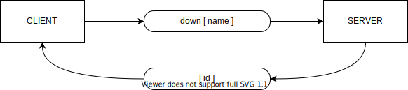

# black-jack-app
Simple multiplayer blackjack card game

## Install
```sh
npm install
```

## Start
```sh
npm start
```

## Web Socket Actions

### Connect
Client `connect` to server


```javascript
const socket = io('http://127.0.0.1:4000'); // Set server host
```

### Down
Client sending `down` to server with player name and receive the player id



```javascript
socket.emit('down', 'Player Name', player => {
    const playerId = player.id;
});
```

### Bet
Server ask players to do betting


Client must subscribe to `bet`

```javascript
socket.on('bet', async (question, callback) => {
    callback(bet); // bet must be 'enough' or number of multiply
});
```

Also client must subscribe to `updates` for receive updated game data

```javascript
socket.on('updates', updates => {

    updates.shufflingMachine.shoe; // Shoe length
    updates.shufflingMachine.played; // Played length

    updates.dealer.hand; // Array of dealer cards
    updates.dealer.total; // Dealer total hand sum
    updates.dealer.status; // Dealer status

    updates.seats, // Array of seats
    updates.freeSeats, // Array of free seats
    updates.active // Player id whose turn it is now

});
```


### Deal
Server ask players to deal


Client must subscribe to `deal`

```javascript
socket.on('deal', async (question, callback) => {
    callback(ansver); // ansver must be 'enough' or 'hit`
});
```

### Leave
Client can leave game anytime 


```javascript
socket.emit('leave');
```