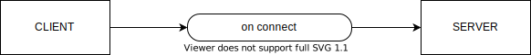
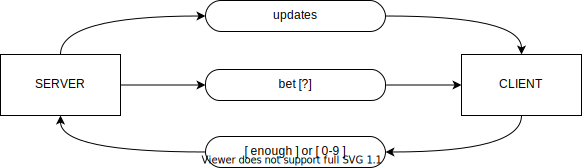
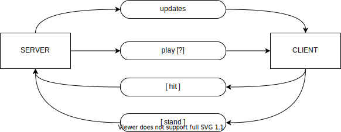
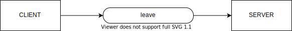

# black-jack-app ♠️
Simple multiplayer blackjack card game

## Install
```sh
npm install
```

## Configure 

Configure server

Open and edit (optional) [config.server.ts](src/config.server.ts)

```typescript
export default {
    host: '127.0.0.1',
    port: 4000
}
```

Configure game

Open and edit (optional) [config.game.ts](src/config.game.ts)

```typescript
import { TokenValue } from "./entities/token";

export default {
    maxSeats: 5, // Maximum number of players 
    minBet: [TokenValue.$1, TokenValue.$1], // Minimal bet
    amountDeck: 5 // Amount of decks in the shuffling machine
}
```

## Start

Run script

```sh
npm start
```

Open [http://127.0.0.1:4000](http://127.0.0.1:4000) in your browser for test game.

---

## Web Socket Actions

### Connect
Client `connect` to server.

Then the server generate new player.



```javascript
const socket = io('http://127.0.0.1:4000'); // Set server host
```

### Down

Join game action (sit at the table)

Client sending `join` to server with player name and receive the player id.


```javascript
socket.emit('join', 'Player Name', player => {
    const playerId = player.id;
});
```

Then the server push player to the game queue.

### Bet
Server asks player to bet



Client must subscribe to `bet`.

Client (player) have 10 seconds for answer (callback). Otherwise the server go to next player or next game step.

```javascript
socket.on('bet', async (question, callback) => {
    callback(bet); // bet must be 'enough' or number of multiply
});
```

Also client must subscribe to `updates` for receive updated game data

```javascript
socket.on('updates', updates => {

    updates.shufflingMachine.shoe; // Shoe length
    updates.shufflingMachine.played; // Played length

    updates.dealer.hand; // Array of dealer cards
    updates.dealer.total; // Dealer total hand sum
    updates.dealer.status; // Dealer status

    updates.seats, // Array of seats
    updates.freeSeats, // Array of free seats
    updates.active // Player id whose turn it is now

});
```

### Playing loop
Server asks player to play



Client must subscribe to `play`.

Client (player) have 10 seconds for answer (callback). Otherwise the server go to next player or next game step.

```javascript
socket.on('play', async (question, callback) => {
    callback(ansver); // ansver must be 'stand' or 'hit`
});
```

The player must decide whether to "stand" (not ask for another card) or "hit" (ask for another card in an attempt to get closer to a count of 21, or even hit 21 exactly).

### Leave
Client can leave game anytime 



```javascript
socket.emit('leave');
```